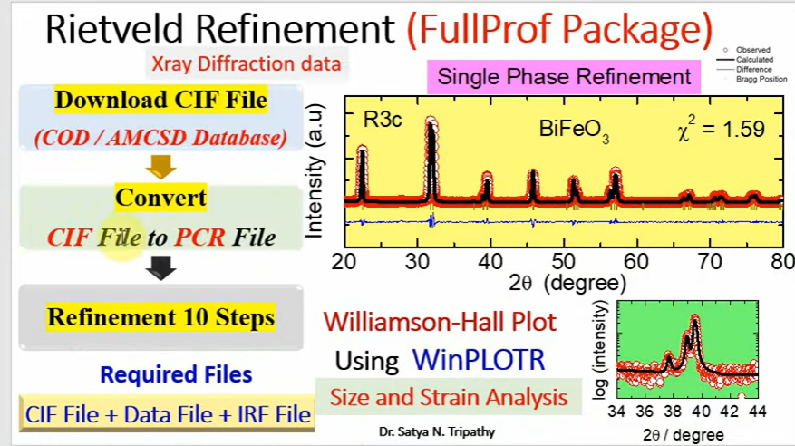
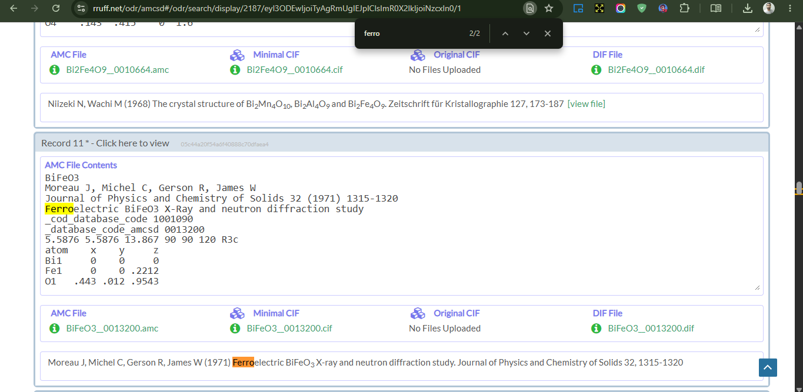

# Rietveld Refinement of X-ray Diffraction Data Using FullProf Package - Part I


```txt
Structural Analysis using Rietveld Refinement (FullProf Package/ Suite): 
This video demonstrates the Rietveld refinement of X-ray diffraction data using FullProf Package (https://www.ill.eu/sites/fullprof/). 
Three files are required: 1. X-ray Diffraction Data, 2. Crystallographic Information file (CIF File), 3. Instrumental resolution file (IRF File) (Optional). 
The CIF Files can be downloaded from COD Database (https://www.crystallography.net/cod/index.php) or AMCSD database (https://www.crystallography.net/cod/search.php)
The results of the analysis will provide 
1. Lattice parameter, (h k l), atomic positions, crystallite size and strain which is useful for structural analysis in material science.
```




Link - https://www.youtube.com/watch?v=GI3N3HVN3xc

> Download the .cif file  
> Enter the Bi, Fe and O 

https://www.crystallography.net/cod/search.php

> Then go to this website -  American Mineralogist database
> Link - https://www.rruff.net/amcsd/  
> select the elements - Bismuth, Iron and Oxygen  
> And click search  

This is the file we need to download  



> You have to download atleast one  
> Now, next is our X-ray diffraction Data file  

